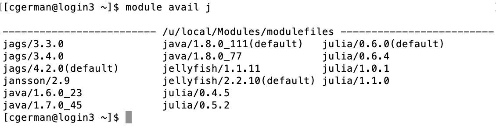

# Hoffman2 / Cluster Computing Introduction and Tutorial 

This notebook was created for `julia v1.1.0`. There is an `R` version available as well in this github repo. It goes over the basics of [UCLA Hoffman2](https://idre.ucla.edu/hoffman2).

At the time of running, this was run with the following specs:


```julia
versioninfo()
```

    Julia Version 1.1.0
    Commit 80516ca202 (2019-01-21 21:24 UTC)
    Platform Info:
      OS: macOS (x86_64-apple-darwin14.5.0)
      CPU: Intel(R) Core(TM) i7-4850HQ CPU @ 2.30GHz
      WORD_SIZE: 64
      LIBM: libopenlibm
      LLVM: libLLVM-6.0.1 (ORCJIT, haswell)


## What is it?

A computer cluster is a set of connected computers (nodes) that work together under one system. Each node will have its own instance of an operating system and hardware. Clusters are used for high-performace distributed computing tasks. They are ideal for multilevel simulations and large-scale computations.

The Hoffman2 Cluster is a group of computing nodes that consists of over 1,200 64-bit nodes and 13,340 cores. It has an aggergate of over 50TB of memory. It consists of login nodes and compute nodes. Login nodes are where you can organize data (install packages, arrange data) and submit jobs and compute nodes are where computer-intensive tasks are run.


# Account Creation
The first step you need to take is to create an account.

Register for an account at: https://www.hoffman2.idre.ucla.edu/getting-started/#newuser

Once you register and your account gets approved, you’ll get an email with a link to see your temporary password that must be used within 4 weeks.

# Logging in 

To login, go to terminal linux/unix and type:

```
ssh username@hoffman2.idre.ucla.edu 

```


and enter your password when prompted (Can also setup ssh keys so no password is required) https://www.hoffman2.idre.ucla.edu/access/passwordless_ssh/.

# Basic Commands
To use Hoffman2, you have to use linux/unix commands to navigate. See Dr. Zhou's linux slides for more details.

Some useful commands:

  * make a directory: `mkdir dirname `  
  * go to home directory: `cd`  
  * go to a certain directory: `cd /path/ `  
  * see current directory: `pwd`  
  * remove a file: `rm filename`  
  * remove a directory: `rm -r dirname`  
  * see whats in current directory: `ls`  
  * see whats in current directory (including hidden items): `ls -a`  
  * see size of current directory: `du -h`  
  * transfer files between cluster/local computer via ssh: `scp` (more on this later) 
  * to go to directory containing the current directory: `cd ..`
  

# Available Software

Current software that you can use on Hoffman2 can be found using:
```
module avail


```


 
(More than the ones shown are available... it's a very long list).

To see available modules that begin with a specific phrase, such as those that start with j type:

``` 
module avail j
```



# Loading Software
To load a module, say `julia` version 1.1.0, for use type:
```
module load julia/1.1.0
```

If you are going to need packages installed for your use on Hoffman2, load julia using `julia` and then install the packges. Note: This should be done on a compute node as compiling julia and libraries can take quite a bit of resources. Therefore, you should use `qrsh`, discussed later to do this. Computing power is limited on login nodes so you should not run any analyses on the login node.


# Accessing a compute node

## qsub

For most analyses/jobs you'd like to run on Hoffman2, you should use the `qsub` command. This submits a batch job to the queue (scheduler). The type of file you `qsub` has to have a specific format (shell script).


```julia
;cat submit.sh
```

    #!/bin/bash #sets bash up
    #$ -cwd #uses current working directory
    # error = Merged with joblog
    #$ -o joblog.$JOB_ID #creates a file called joblog.jobidnumber to write to. 
    #$ -j y 
    #$ -l h_rt=0:30:00,h_data=2G #requests 30 minutes, 2GB of data (per core)
    #$ -pe shared 2 #requests 2 cores
    # Email address to notify
    #$ -M $USER@mail #don't change this line, finds your email in the system 
    # Notify when
    #$ -m bea #sends you an email (b) when the job begins (e) when job ends (a) when job is aborted (error)
    
    # load the job environment:
    . /u/local/Modules/default/init/modules.sh
    module load julia/1.1.0 #loads julia/1.1.0 for use 
    
    # run julia code
    echo 'Running runSim.jl for n = 500' #prints this quote to joblog.jobidnumber
    julia -e "n = 500;  include('runSim.jl')" > output.$JOB_ID 2>&1 #runs julia code in quotes and outputs any text to output.JOB_ID


To send this script to the scheduler to run on a compute node, you would simply type:

```
qsub submit.sh
```

## qrsh

For some analyses, you may want to do things interactively instead of just submitting jobs. The `qrsh` command is for loading you onto an interactive compute node. 

Typing `qrsh` on the Hoffman2 login node will submit q request for an interactive session. By default, the session will run for two hours and the physical memory alotted will be 1GB.

To request more, you can use the commmand
```
qrsh -l h_rt=4:00:00,h_data=4G
```

This will request a four hour session where the maximum physical memory is 4GB. 

If you'd like to use more than one CPU core for your job, add `-pe shared #` to the end. Note, the amount of memory requested will be for each core. For example, if you'd like to request 4 CPU cores, each with 2GB of memory for a total of 8GB for 5 hours, run:
```
qrsh -l h_rt=5:00:00,h_data=2G -pe shared 4
```

The more time and memory you request, the longer you will have to wait for an interactive compute node to become available to you. It's normal to wait a few minutes to get an interactive session. 

For more advanced options you can use
                                        
```
   qrsh -help                                     
```

## Resource limitations
The maximum time for a session is 24 hours unless you're working in a group that owns their compute nodes. So do not have an `h_rt` value greated than `h_rt=24:00:00`.

Different compute nodes have different amounts of memory. There are fewer nodes with lots of memory, so the larger the amount of memory you're requesting the longer you will have to wait for the job to start running. If you request too much, the job may never run. 

Requesting more than 4 cores for an interactive session can possibly take a long time for the interactive session to start. 


## A single simulation run

The `runSim.jl` runs a simulation study to compare two methods for estimating mean: `est_mean_prime` and `est_mean_avg`. In each replicate, it generates a random vector of sample size `n`, from distribution `d`, and using seed `s`. There are `reps` replicates. Values of `n`, `d`, `s` and `reps` are to be defined by the user. `oFile` is the file to save the results under. Simulation results are written to a CSV file, `outfile`. 


```julia
;cat runSim.jl
```

    using DelimitedFiles, Distributions, Primes, Random, Statistics
    
    """
        est_mean_prime(x)
    
    Estimate mean by averaging prime-indexed data in `x`.
    """
    function est_mean_prime(x::Vector{<:Real})
        s, c = zero(eltype(x)), 0
        for i in eachindex(x)
            if Primes.isprime(i)
                s += x[i]
                c += 1
            end
        end
        s / c
    end
    
    """
        est_mean_avg(x)
    
    Estimate mean by sample average.
    """
    function est_mean_avg(x::Vector{<:Real})
        mean(x)
    end
    
    function compare_methods(n::Int, d::ContinuousUnivariateDistribution)
        x = rand(d, n)
        est_mean_avg(x), est_mean_prime(x)
    end
    
    # Simulate `reps` replicates of sample size `n` from distribution `d` using seed `s`
    simres = zeros(reps, 2)
    for r in 1:reps
        Random.seed!(s)
        x = rand(d, n)
        simres[r, 1] = est_mean_avg(x)
        simres[r, 2] = est_mean_prime(x)
    end
    
    outfile = "n_$(n)_reps_$(reps)_dist_$(d).txt"
    DelimitedFiles.writedlm(outfile, simres, ",")
    # may add an optional zip step here to reduce storage

To run this simulation from command line, user needs to pass values for `n`, `d`, `s`, `reps`. For example,
```
module load julia/1.1.0
julia -e "n = 100; d = 'Normal()'; reps = 100; s = 123; include('runSim.jl')"
```

We can see the results have been written to the txt file.
```{bash}
head n_100d_rnorm\(n\).txt 
```

If you experience an error, you can take a look at the output.#### file that was generated. This files indicates any output generated in julia. 


Alternatively, as mentioned before. You can use a `.sh` script like the `submit.sh` and submit the job using 
```
qsub jobscript.sh
```

## Multiple simulation runs

In many projects, we vary the values of different simulation factors such as sample size, generative model, and so on. We can write another julia script to organize multiple simulations. It's easy to set up and perform embarrasingly parallel simulation tasks.

On a cluster, each simulation needs to be submitted separately (spread across different compute nodes). The syntax depends on the scheduling system. On UCLA's Hoffman2 cluster, `qsub` is used. In `ClusterSim.jl`, we loop over n = 100, 200, ..., 500 and generative models standard normal, T distribution with 5 degree of freedom, and T distribution with 1 degree of freedom and submit the jobs by building the file with each scenario to submit and using `qsub`. 


```julia
;cat ClusterSim.jl
```

    reps = 100 # number of simulatin replicates
    s = 123 # seed
    for n in 100:100:500
        for d in ["Normal()", "TDist(5)", "TDist(1)"]
            println("submit job for n=$n, d=$d")
            jcode = "using Distributions; d, n, reps, s = $d, $n, $reps, $s; include(\"runSim.jl\")"
            # prepare sh file for qsub
            open("tmp.sh", "w") do io
                println(io, "#!/bin/bash")
                println(io, "#\$ -cwd")
                println(io, "# error = Merged with joblog")
                println(io, "#\$ -o joblog.\$JOB_ID")
                println(io, "#\$ -j y")
                println(io, "#\$ -l h_rt=0:30:00,h_data=2G") # request runtime and memory
                println(io, "#\$ -pe shared 2") # request # shared-memory nodes
                println(io, "# Email address to notify")
                println(io, "#\$ -M \$USER@mail")
                println(io, "# Notify when")
                println(io, "#\$ -m a")
                println(io)
                println(io, "# load the job environment:")
                println(io, ". /u/local/Modules/default/init/modules.sh")
                println(io, "module load julia/1.0.1")
                println(io, "module load R/3.5.1")
                println(io)
                println(io, "# run julia code")
                println(io, "julia -e '$jcode' > output.\$JOB_ID 2>&1")
            end
            # submit job
            run(`qsub tmp.sh`)
        end
    end


So on the cluster we just need to run the following on an interactive compute node
```
julia ClusterSim.R
```


The generated `tmp.sh` file will read like this with different sample size and distributions created:


```julia
;cat tmp.sh
```

    #!/bin/bash
    #$ -cwd
    # error = Merged with joblog
    #$ -o joblog.$JOB_ID
    #$ -j y
    #$ -l h_rt=0:30:00,h_data=2G
    #$ -pe shared 2
    # Email address to notify
    #$ -M $USER@mail
    # Notify when
    #$ -m a
    
    # load the job environment:
    . /u/local/Modules/default/init/modules.sh
    module load julia/1.0.1
    module load R/3.5.1
    
    # run julia code
    julia -e 'using Distributions; d, n, reps, s = TDist(1), 500, 100, 123; include("runSim.jl")' > output.$JOB_ID 2>&1


You can check on the state of your current jobs by running:
```{bash, eval=FALSE}
myjob
```


This command tells you the status of your job in the queue `qw` for queued and waiting, `r` for running. It also tells you the number of cores requested for the job, when the job was requested, and which nodes the job is running on.


To check the output files generated after the jobs have run:


```julia
cd(readdir, "simresults")
```


    15-element Array{String,1}:
     "n_100_reps_100_dist_Normal{Float64}(μ=0.0, σ=1.0).txt"
     "n_100_reps_100_dist_TDist{Float64}(ν=1.0).txt"        
     "n_100_reps_100_dist_TDist{Float64}(ν=5.0).txt"        
     "n_200_reps_100_dist_Normal{Float64}(μ=0.0, σ=1.0).txt"
     "n_200_reps_100_dist_TDist{Float64}(ν=1.0).txt"        
     "n_200_reps_100_dist_TDist{Float64}(ν=5.0).txt"        
     "n_300_reps_100_dist_Normal{Float64}(μ=0.0, σ=1.0).txt"
     "n_300_reps_100_dist_TDist{Float64}(ν=1.0).txt"        
     "n_300_reps_100_dist_TDist{Float64}(ν=5.0).txt"        
     "n_400_reps_100_dist_Normal{Float64}(μ=0.0, σ=1.0).txt"
     "n_400_reps_100_dist_TDist{Float64}(ν=1.0).txt"        
     "n_400_reps_100_dist_TDist{Float64}(ν=5.0).txt"        
     "n_500_reps_100_dist_Normal{Float64}(μ=0.0, σ=1.0).txt"
     "n_500_reps_100_dist_TDist{Float64}(ν=1.0).txt"        
     "n_500_reps_100_dist_TDist{Float64}(ν=5.0).txt"        


# Transfering Files

## scp

`scp`, standing for secure copy paste, allows you to transfer files between an ssh server and your local computer. It's a useful command if you set up ssh keys so that you won't have to enter your password every time you want to transfer files.

To use `scp`:

  * go to directory you want to store things/send things in/from on local computer.
  * To send a file from local to cluster :
    + `scp filename.extension username@hoffman2.idre.ucla.edu:∼/directorytosavein/`
  * To send multiple files from local to cluster
    + `scp filename1.extension filename2.extension username@hoffman2.idre.ucla.edu:∼/directorytosavein/`
  * To send a file from cluster to local
    + `scp username@hoffman2.idre.ucla.edu:∼/directoryitsin/filename.extension .`
  * To send multiple files from cluster to local 
    + `scp username@hoffman2.idre.ucla.edu:∼/directoryitsin/{filename1.extension,filename2.extension} . `
  * To send directory with all files from cluster to local
    + `scp -r username@hoffman2.idre.ucla.edu:∼/directorytosend .`
    
    
## Globus 

Globus allows you to transfer files between your local computer and the cluster. 
To use Globus you will have to go to [www.globus.com](www.globus.com) and login through UCLA by selecting your existing organizational login as UCLA. 

Then you will need to download their Globus Connect Personal software, then set your laptop as an endpoint.

Very detailed instructions can be found here [https://www.hoffman2.idre.ucla.edu/file-transfer/globus/](https://www.hoffman2.idre.ucla.edu/file-transfer/globus/)

In short,login to globus, then under endpoints, select `Create new endpoint`.
Select a Globus Personal connect, then enter a name. Generate an installation setup key, save it somewhere, and then download the client. 
Once you launch the client, enter the setup key and you will have created an endpoint where you can transfer files to. 

From there, you can login to [globus.com](globus.com) or launch Globus Connect Personal and click files transfer. There you can choose to transfer files between your machine and the cluster. To find the endpoint to transfer files to/from on the server, search "Hoffman2" in the Collection bar of the File Manager and select one of the official UCLA Hoffman2 Data Transfer Nodes.  


# Canceling a job 

To cancel a job that is running or in the queue `qdel` is the command, use `myjob` to determine the job ID 
and then type:


```
qdel -u yourusername jobID

```

and the job will be canceled. To cancel all jobs simply leave `jobID` blank. 

# Using Jupyter Notebook

To use Jupyter Notebook interactively in Hoffman2, follow the instructions linked [here](https://www.hoffman2.idre.ucla.edu/access/jupyter-notebook/)

Note, to use Julia in Jupyter notebook, you will need to make sure you have installed the `IJulia` package in the version of julia that you would like to use -- to use `julia v1.1.0`, login to Hoffman2, use the `qrsh` command to get an interactive compute note, then load julia 1.1.0, and launch julia and install the `IJulia` package.

# Additional Resources

Office Hours: Dr. Raffaella D’Auria. Set up by sending an email (ticket) to hpc@ucla.edu
