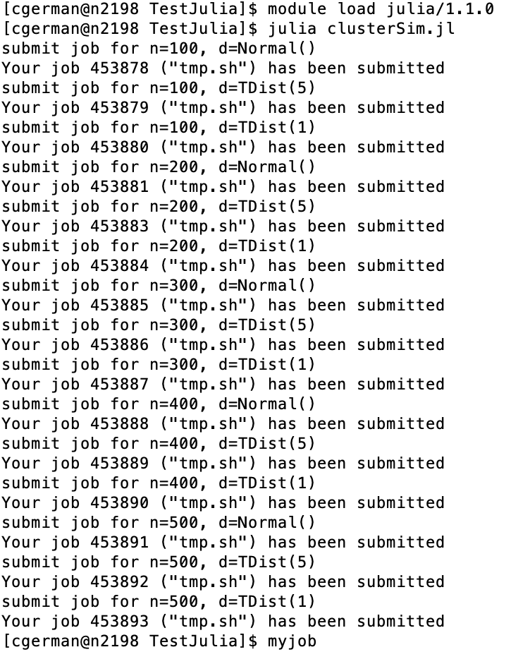
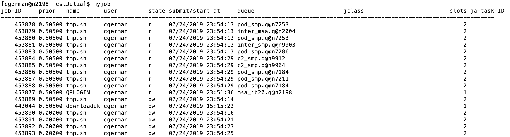

-   [Hoffman2 Julia Tutorial](#hoffman2-julia-tutorial)
    -   [What is it and how to use](#what-is-it-and-how-to-use)
    -   [Available Julia Versions](#available-julia-versions)
    -   [Loading Julia](#loading-julia)
    -   [Accessing a compute node](#accessing-a-compute-node)
        -   [qsub](#qsub)
        -   [qrsh](#qrsh)
    -   [Resource limitations](#resource-limitations)
    -   [A single simulation run](#a-single-simulation-run)
    -   [Multiple simulation runs](#multiple-simulation-runs)
    -   [Using Jupyter Notebook](#using-jupyter-notebook)
    -   [Jobs crashing/failing/killed for some
        reason](#jobs-crashingfailingkilled-for-some-reason)

Hoffman2 Julia Tutorial
=======================

This tutorial was created for `julia v1.6`. There is an [R
version](https://github.com/chris-german/Hoffman2Tutorials/tree/master/RTutorial)
available as well in this github repo. It goes over details of Hoffman2
jobs specific to R as well as running similar simulations in `R`.

What is it and how to use
-------------------------

For basic information on Hoffman2, including submitting jobs, resources
available, transfering files, and other general information, refer to
the general `README.md` file found at the [initial page of the github
repo](https://github.com/chris-german/Hoffman2Tutorials).

Available Julia Versions
------------------------

There are several versions of Julia available on Hoffman2. To see the
versions currently available, type:

    module avail julia

Loading Julia
-------------

To load a module, say `julia` version 1.6, for use type:

    module load julia/1.6

If you are going to need packages installed for your use on Hoffman2,
load julia using `julia` and then install the packges. Note: This should
be done on a compute node as compiling julia and libraries can take
quite a bit of resources. Therefore, you should use `qrsh`, discussed in
the general guide. Computing power is limited on login nodes so you
should not run any analyses on the login node.

Accessing a compute node
------------------------

### qsub

For most analyses/jobs you’d like to run on Hoffman2, you should use the
`qsub` command. This submits a batch job to the queue (scheduler). The
type of file you `qsub` has to have a specific format (shell script).

    cat submit.sh

    ## #!/bin/bash
    ## #$ -cwd #uses current working directory
    ## # error = Merged with joblog
    ## #$ -o joblog.$JOB_ID #creates a file called joblog.jobidnumber to write to. 
    ## #$ -j y 
    ## #$ -l h_rt=0:30:00,h_data=2G #requests 30 minutes, 2GB of data (per core)
    ## #$ -pe shared 2 #requests 2 cores
    ## # Email address to notify
    ## #$ -M $USER@mail #don't change this line, finds your email in the system 
    ## # Notify when
    ## #$ -m bea #sends you an email (b) when the job begins (e) when job ends (a) when job is aborted (error)
    ## 
    ## # load the job environment:
    ## . /u/local/Modules/default/init/modules.sh
    ## module load julia/1.6 #loads julia/1.6 for use 
    ## 
    ## # run julia code
    ## echo 'Running runSim.jl for n = 100' #prints this quote to joblog.jobidnumber
    ## julia runSim.jl 100 100 123 "Normal()" > output.$JOB_ID 2>&1 # seed n reps seed distribition
    ## #julia -e 'using Distributions; n = 100; d = Normal(); reps = 100; s = 123; include("runSim.jl")' > output.$JOB_ID 2>&1 #runs julia code in quotes and outputs any text to output.JOB_ID

To send this script to the scheduler to run on a compute node, you would
simply type:

    qsub submit.sh

### qrsh

For some analyses, you may want to do things interactively instead of
just submitting jobs. The `qrsh` command is for loading you onto an
interactive compute node.

Typing `qrsh` on the Hoffman2 login node will submit q request for an
interactive session. By default, the session will run for two hours and
the physical memory alotted will be 1GB.

To request more, you can use the commmand

    qrsh -l h_rt=4:00:00,h_data=4G

This will request a four hour session where the maximum physical memory
is 4GB.

If you’d like to use more than one CPU core for your job, add
`-pe shared #` to the end. Note, the amount of memory requested will be
for each core. For example, if you’d like to request 4 CPU cores, each
with 2GB of memory for a total of 8GB for 5 hours, run:

    qrsh -l h_rt=5:00:00,h_data=2G -pe shared 4

The more time and memory you request, the longer you will have to wait
for an interactive compute node to become available to you. It’s normal
to wait a few minutes to get an interactive session.

For more advanced options you can use

    qrsh -help                                     

Once the interactive session loads, you can use

    module load julia/1.6
    julia

to load `julia v1.6`.

Resource limitations
--------------------

The maximum time for a session is 24 hours unless you’re working in a
group that owns their compute nodes. So do not have an `h_rt` value
greated than `h_rt=24:00:00`.

Different compute nodes have different amounts of memory. There are
fewer nodes with lots of memory, so the larger the amount of memory
you’re requesting the longer you will have to wait for the job to start
running. If you request too much, the job may never run.

Requesting more than 4 cores for an interactive session can possibly
take a long time for the interactive session to start.

A single simulation run
-----------------------

The [`runSim.jl`](./runSim.jl) runs a simulation study to compare two
methods for estimating mean: `est_mean_prime` and `est_mean_avg`. In
each replicate, it generates a random vector of sample size `n`, from
distribution `dist`, and using seed `seed`. There are `reps` replicates.
Values of `n`, `dist`, `seed` and `reps` are to be defined by the user.
`oFile` is the file to save the results under. Simulation results are
written to a CSV file, `outfile`.

    cat runSim.jl

    ## using DelimitedFiles, Distributions, Primes, Random, Statistics
    ## n = parse(Int, ARGS[1])
    ## reps = parse(Int, ARGS[2])
    ## seed = parse(Int, ARGS[3])
    ## if length(ARGS) < 4
    ##     d = Normal()
    ## else
    ##     d = eval(Meta.parse(ARGS[4]))
    ## end
    ## 
    ## """
    ##     est_mean_prime(x)
    ## 
    ## Estimate mean by averaging prime-indexed data in `x`.
    ## """
    ## function est_mean_prime(x::Vector{<:Real})
    ##     s, c = zero(eltype(x)), 0
    ##     for i in eachindex(x)
    ##         if Primes.isprime(i)
    ##             s += x[i]
    ##             c += 1
    ##         end
    ##     end
    ##     s / c
    ## end
    ## 
    ## """
    ##     est_mean_avg(x)
    ## 
    ## Estimate mean by sample average.
    ## """
    ## function est_mean_avg(x::Vector{<:Real})
    ##     mean(x)
    ## end
    ## 
    ## function compare_methods(n::Int, d::ContinuousUnivariateDistribution)
    ##     x = rand(d, n)
    ##     est_mean_avg(x), est_mean_prime(x)
    ## end
    ## 
    ## # Simulate `reps` replicates of sample size `n` from distribution `d` using seed `s`
    ## simres = zeros(reps, 2)
    ## Random.seed!(seed)
    ## for r in 1:reps
    ##     x = rand(d, n)
    ##     simres[r, 1] = est_mean_avg(x)
    ##     simres[r, 2] = est_mean_prime(x)
    ## end
    ## 
    ## outfile = "simresults/n_$(n)_reps_$(reps)_dist_$(d).txt"
    ## DelimitedFiles.writedlm(outfile, simres, ",")
    ## # may add an optional zip step here to reduce storage

To run this simulation from command line, user needs to pass values for
`n`, `reps`,`seed`, and `dist`, in that order. `dist` is a string that
contains a command to initialize a distribution. For example,

    module load julia/1.6
    julia runSim.jl 100 100 123 "Normal()"

We can see the results have been written to the txt file.

    head simresults/n_100_reps_100_dist_Normal\{Float64\}\(μ\=0.0\,\ σ\=1.0\).txt 

    ## 0.036692077201688614,0.06410204168833543
    ## 0.10929809874083732,0.31435190199240665
    ## -0.04052745259955622,-0.0837351522409666
    ## 0.04151985695102858,0.0023132346304908322
    ## 0.05656696361430833,0.13782916923366778
    ## -0.061773946470394095,-0.09831073727533834
    ## -0.0028930093438773374,-0.06760720427643079
    ## -0.036945842876762294,0.055500952666579166
    ## 0.16861614873909925,-0.10980532477330993
    ## -0.012577896614038043,0.1523025560690629

If you experience an error, you can take a look at the output.\#\#\#\#
file that was generated. This files indicates any output generated in
julia.

Alternatively, as mentioned before. You can use a `.sh` script like the
`submit.sh` and submit the job using

    qsub submit.sh

Multiple simulation runs
------------------------

In many projects, we vary the values of different simulation factors
such as sample size, generative model, and so on. We can write a
jobarray script to do this.
<!--We can write another julia script to organize multiple simulations. It's easy to set up and perform embarrasingly parallel simulation tasks.-->

On a cluster, each simulation can be submitted in a jobarray, which can
be spread across different compute nodes. The syntax depends on the
scheduling system. On UCLA’s Hoffman2 cluster, `qsub` is used. In
[`submit_array.sh`](./submit_array.sh), we submit sample sizes n (100,
200, …, 500) and generative models given as a command-line argument
(standard normal by default, and it can be anything else) we can submit
the jobs using `qsub`.

    cat submit_array.sh

    ## #!/bin/bash
    ## #$ -cwd #uses current working directory
    ## # error = Merged with joblog
    ## #$ -o joblog.$JOB_ID.$TASK_ID #creates a file called joblog.jobidnumber.taskidnumber to write to. 
    ## #$ -j y 
    ## #$ -l h_rt=0:30:00,h_data=2G #requests 30 minutes, 2GB of data (per core)
    ## #$ -pe shared 2 #requests 2 cores
    ## # Email address to notify
    ## #$ -M $USER@mail #don't change this line, finds your email in the system 
    ## # Notify when
    ## #$ -m bea #sends you an email (b) when the job begins (e) when job ends (a) when job is aborted (error)
    ## #$ -t 100-500:100 # 100 to 500, with step size of 100
    ## 
    ## # load the job environment:
    ## . /u/local/Modules/default/init/modules.sh
    ## module load julia/1.6 #loads julia/1.6 for use 
    ## 
    ## echo ${SGE_TASK_ID}
    ## echo $1
    ## # run julia code
    ## echo 'Running runSim.jl for n = 100' #prints this quote to joblog.jobidnumber
    ## julia runSim.jl ${SGE_TASK_ID} 100 123 $1 > output.$JOB_ID.${SGE_TASK_ID} 2>&1 # n reps seed distribition

So on the cluster we just need to run the following on an interactive
compute node

    qsub submit_array.sh

<!---->
One may try different distributions. Examples of 5-df T distribution and
1-df T distributions are given in `run_arrays.sh`.

    cat run_arrays.sh

    ## qsub submit_array.sh # defaults to Normal()
    ## qsub submit_array.sh "Normal()"
    ## qsub submit_array.sh "TDist(5)"
    ## qsub submit_array.sh "TDist(1)"

You can submit these jobs by just running this script:

    bash run_arrays.sh

You can check on the state of your current jobs by running:

    myjob

This command tells you the status of your job in the queue `qw` for
queued and waiting, `r` for running. It also tells you the number of
cores requested for the job, when the job was requested, and which nodes
the job is running on.

To check the output files generated after the jobs have run:

    ls simresults/*.txt

    ## simresults/n_100_reps_100_dist_Normal{Float64}(μ=0.0, σ=1.0).txt
    ## simresults/n_100_reps_100_dist_TDist{Float64}(ν=1.0).txt
    ## simresults/n_100_reps_100_dist_TDist{Float64}(ν=5.0).txt
    ## simresults/n_10_reps_10_dist_Normal{Float64}(μ=0.0, σ=1.0).txt
    ## simresults/n_200_reps_100_dist_Normal{Float64}(μ=0.0, σ=1.0).txt
    ## simresults/n_200_reps_100_dist_TDist{Float64}(ν=1.0).txt
    ## simresults/n_200_reps_100_dist_TDist{Float64}(ν=5.0).txt
    ## simresults/n_300_reps_100_dist_Normal{Float64}(μ=0.0, σ=1.0).txt
    ## simresults/n_300_reps_100_dist_TDist{Float64}(ν=1.0).txt
    ## simresults/n_300_reps_100_dist_TDist{Float64}(ν=5.0).txt
    ## simresults/n_400_reps_100_dist_Normal{Float64}(μ=0.0, σ=1.0).txt
    ## simresults/n_400_reps_100_dist_TDist{Float64}(ν=1.0).txt
    ## simresults/n_400_reps_100_dist_TDist{Float64}(ν=5.0).txt
    ## simresults/n_500_reps_100_dist_Normal{Float64}(μ=0.0, σ=1.0).txt
    ## simresults/n_500_reps_100_dist_TDist{Float64}(ν=1.0).txt
    ## simresults/n_500_reps_100_dist_TDist{Float64}(ν=5.0).txt

Using Jupyter Notebook
----------------------

To use Jupyter Notebook interactively in Hoffman2, follow the
instructions linked
[here](https://www.hoffman2.idre.ucla.edu/Using-H2/Connecting/Connecting.html#connecting-via-jupyter-notebook-lab)

Note, to use Julia in Jupyter notebook, you will need to make sure you
have installed the `IJulia` package in the version of julia that you
would like to use – to use `julia v1.6`, login to Hoffman2, use the
`qrsh` command to get an interactive compute note, then load julia
1.1.0, and launch julia and install the `IJulia` package.

Jobs crashing/failing/killed for some reason
--------------------------------------------

Julia jobs may randomly crash on Hoffman. There are 3 common reasons. 1.
Insufficient virtual memory. Even if your program require little
physical memory, it may have larger than expected virtual memory
requirement. See [how much virtual memory you
need](https://www.hoffman2.idre.ucla.edu/About/FAQ/FAQ.html?highlight=maxvmem#how-much-virtual-memory-should-i-request-in-job-submission).
Adding the `-l exclusive` flag bypasses virtual memory checking. 2. If
you are using Julia from the system-wide installation via
`module load julia` (or downloaded the prebuilt Julia by yourself from
Julia’s download web site), it is recommended to do so on Intel nodes,
as required by the prebuilt Julia. To do so, add the option
`-l arch=intel*` to `qsub`, or `-l arch=intel\*` to qrsh. (The escape
character `\` is necessary in `qrsh` since it is issued from the command
prompt.)
<!--3. Some Julia packages require the `glibc` library newer than what CentOS 6 has. In that case, you will have to run on the CentOS 7 nodes. To do so, add `-l rh7` to `qrsh` or `qsub` commands. There are only a small number of CentOS 7 nodes right now; you may experience longer wait time that running on CentOS 6. Hoffman2 cluster will eventually transition to CentOS 7; the transition will take some time to complete but has started (3/23/2021).-->

Credit goes to Shiao-Ching Huang (@schuang) for pointing out 2.
