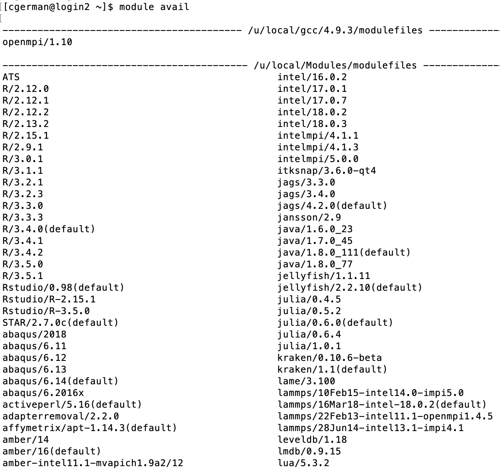
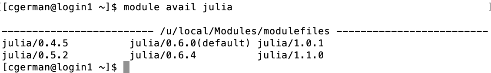

-   [Hoffman2 Tutorials for
    Biostatisticians](#hoffman2-tutorials-for-biostatisticians)
    -   [What is Hoffman2](#what-is-hoffman2)
    -   [Account Creation](#account-creation)
    -   [Logging in](#logging-in)
    -   [Basic Linux Commands](#basic-linux-commands)
    -   [Available Software](#available-software)
    -   [Loading Software](#loading-software)
    -   [Transfering Files](#transfering-files)
        -   [scp](#scp)
        -   [Globus](#globus)
        -   [Git and SVN](#git-and-svn)
    -   [Submit Jobs to Hoffman2](#submit-jobs-to-hoffman2)
        -   [Submit a batch job by `qsub`](#submit-a-batch-job-by-qsub)
        -   [Interactive session by
            `qrsh`](#interactive-session-by-qrsh)
        -   [Resource limitations](#resource-limitations)
        -   [Canceling a job](#canceling-a-job)
    -   [Using Jupyter Notebook](#using-jupyter-notebook)
    -   [Data Storage](#data-storage)
    -   [Biostatistics Specific Nodes](#biostatistics-specific-nodes)
    -   [Request Biostatistics Nodes](#request-biostatistics-nodes)
    -   [R Tutorial](#r-tutorial)
    -   [Julia Tutorial](#julia-tutorial)
    -   [Additional Resources](#additional-resources)

Hoffman2 Tutorials for Biostatisticians
=======================================

This is a guide for using UCLA IDRE’s Hoffman2 cluster computing system.
There are guides for running jobs specific to
[R](https://github.com/chris-german/Hoffman2Tutorials/tree/master/RTutorial)
and
[Julia](https://github.com/chris-german/Hoffman2Tutorials/tree/master/JuliaTutorial),
as well as general guides for commands and what is available for users.

To try out the sample code in the tutorial, simply issue

    git clone https://github.com/chris-german/Hoffman2Tutorials.git

on Hoffman2 to clone this repository.

This document is mainly compiled by Chris German and Hua Zhou, with
valuable input from Alec Chan-Goldston and Lu Zhang. If you want to
contribute to this tutorial, work on the RMarkdown files `README.Rmd`,
`RTutorial/R_Hoffman2.Rmd`, and `JuliaTutorial/Julia_Hoffman2.Rmd`,
which can be knitted into the corresponding `README.md` files, and make
pull requests.

What is Hoffman2
----------------

A computer cluster is a set of connected computers (nodes) that work
together under one system. Each node has its own instance of an
operating system and hardware. Clusters are used for high-performace
distributed computing tasks. They are ideal for multilevel simulations
and large-scale computations.

The Hoffman2 Cluster is a group of computing nodes that consists of over
1,200 64-bit nodes and 13,340 cores. It has an aggergate of over 50TB of
memory. It consists of login nodes and compute nodes. Login nodes are
where you can organize data (install packages, arrange data) and submit
jobs and compute nodes are where computer-intensive tasks are run.

Account Creation
----------------

The first step is to create an account.

Register for an account at
<a href="https://www.hoffman2.idre.ucla.edu/getting-started/#newuser" class="uri">https://www.hoffman2.idre.ucla.edu/getting-started/#newuser</a>.

For faculty sponsor, you can choose your advisor if (s)he is on the
list. If you do not have an advisor yet or (s)he is not on list, you can
choose `Hua Zhou` or `Sudipto Banerjee`. The faculty sponsor will
receive an email after you submit the registration form. Once your
account gets approved, you’ll get an email with a link to see your
temporary password that must be used within 4 weeks.

Logging in
----------

To login, go to terminal in Linux/MacOS and type:

    ssh username@hoffman2.idre.ucla.edu 

and enter your password when prompted. You can also set up the more
secure SSH keys and no password is required, following
<a href="https://www.hoffman2.idre.ucla.edu/access/passwordless_ssh/" class="uri">https://www.hoffman2.idre.ucla.edu/access/passwordless_ssh/</a>.

Upon login, you see a welcome message:

Windows users can use PuTTY, MobaXterm, or Cygwin programs to establish
SSH connection to Hoffman2. See
<a href="https://www.hoffman2.idre.ucla.edu/access/#Windows" class="uri">https://www.hoffman2.idre.ucla.edu/access/#Windows</a>
for details.

Basic Linux Commands
--------------------

To use Hoffman2, which runs on CentOS 6 (a specific Linux distribution),
you have to use linux/unix commands to navigate.

Some most useful commands:

-   make a directory: `mkdir dirname`  
-   go to home directory: `cd`  
-   go to a certain directory: `cd /path/`  
-   see current directory: `pwd`  
-   remove a file: `rm filename`  
-   remove a directory: `rm -r dirname`  
-   see whats in current directory: `ls`  
-   see whats in current directory (including hidden items): `ls -a`  
-   see size of current directory: `du -h`  
-   transfer files between cluster/local computer via ssh: `scp` (more
    on this later)
-   to go to directory containing the current directory: `cd ..`

You can learn more about Linux in Dr. Hua Zhou’s *Biostat 203B:
Introduction to Data Science* course.

Available Software
------------------

You can query available software on Hoffman2 by

    module avail

More than the ones shown are available. It’s a very long list. Most
relevant to biostatisticians include R, Julia, Python, JAGS (Just
Another Gibbs Sampler), Matlab, and Stata.

To see available modules that begin with a specific phrase, such as
those that start with `julia`, type

    module avail julia

Loading Software
----------------

To load a module, say `julia` version 1.1.0, for use type:

    module load julia/1.1.0

If you are going to need packages installed for your use on Hoffman2,
load julia using `julia` and then install the packges. Note: This should
be done on a compute node as compiling julia and libraries can take
quite a bit of resources. Therefore, you should use `qrsh`, discussed
later to do this. Computing power is limited on login nodes so you
should not run any analyses on the login node.

Transfering Files
-----------------

### scp

`scp`, standing for secure copy paste, allows you to transfer files
between an ssh server and your local computer. It’s a useful command if
you set up ssh keys so that you don’t have to enter your password every
time you want to transfer files.

To use `scp`:

-   go to directory you want to store things/send things in/from on
    local computer.
-   To send a file from local to cluster :
    -   `scp filename.extension username@hoffman2.idre.ucla.edu:∼/directorytosavein/`
-   To send multiple files from local to cluster
    -   `scp filename1.extension filename2.extension username@hoffman2.idre.ucla.edu:∼/directorytosavein/`
-   To send a file from cluster to local
    -   `scp username@hoffman2.idre.ucla.edu:∼/directoryitsin/filename.extension .`
-   To send multiple files from cluster to local
    -   `scp username@hoffman2.idre.ucla.edu:∼/directoryitsin/{filename1.extension,filename2.extension} .`
-   To send directory with all files from cluster to local
    -   `scp -r username@hoffman2.idre.ucla.edu:∼/directorytosend .`

### Globus

Globus allows you to transfer files between your local computer and the
cluster. To use Globus you will have to go to
[www.globus.com](www.globus.com) and login through UCLA by selecting
your existing organizational login as UCLA. Then you will need to
download their Globus Connect Personal software, then set your laptop as
an endpoint.

Very detailed instructions can be found here
<a href="https://www.hoffman2.idre.ucla.edu/file-transfer/globus/" class="uri">https://www.hoffman2.idre.ucla.edu/file-transfer/globus/</a>

In short, login to globus, then under endpoints, select
`Create new endpoint`. Select a Globus Personal connect, then enter a
name. Generate an installation setup key, save it somewhere, and then
download the client. Once you launch the client, enter the setup key and
you will have created an endpoint where you can transfer files to.

From there, you can login to [globus.com](globus.com) or launch Globus
Connect Personal and click files transfer. There you can choose to
transfer files between your machine and the cluster. To find the
endpoint to transfer files to/from on the server, search “Hoffman2” in
the Collection bar of the File Manager and select one of the official
UCLA Hoffman2 Data Transfer Nodes.

### Git and SVN

Hoffman2 has Git and svn available, which offer a more productive and
reproducible way to synchornize source code between computers and
platforms.

Submit Jobs to Hoffman2
-----------------------

Hoffman2 uses the UGE (Univa Grid Engine) job schedular to manage
computing jobs on the cluster. See
<a href="https://www.hoffman2.idre.ucla.edu/computing/sge/" class="uri">https://www.hoffman2.idre.ucla.edu/computing/sge/</a>
for some commonly used UGE commands or the more exhaustive [UGE User
Guide](http://www.univa.com/resources/files/univa_user_guide_univa__grid_engine_854.pdf).
Following examples are more specific to biostatistical applications.

### Submit a batch job by `qsub`

For most analyses/jobs, you should use the `qsub` command. This submits
a batch job to the queue (scheduler). The type of file you `qsub` has to
have a specific format (shell script). For example, following sample
script [`submit.sh`](./RTutorial/submit.sh), with line-by-line comment,
submits an R job.

    cat RTutorial/submit.sh

    ## #!/bin/bash #sets bash up
    ## #$ -cwd #uses current working directory
    ## # error = Merged with joblog
    ## #$ -o joblog.$JOB_ID #creates a file called joblog.jobidnumber to write to. 
    ## #$ -j y 
    ## #$ -l h_rt=0:30:00,h_data=2G #requests 30 minutes, 2GB of data (per core)
    ## #$ -pe shared 2 #requests 2 cores
    ## # Email address to notify
    ## #$ -M $USER@mail #don't change this line, finds your email in the system 
    ## # Notify when
    ## #$ -m bea #sends you an email (b) when the job begins (e) when job ends (a) when job is aborted (error)
    ## 
    ## # load the job environment:
    ## . /u/local/Modules/default/init/modules.sh
    ## module load R/3.5.1 #loads R/3.5.1 for use 
    ## 
    ## # run R code
    ## echo 'Running runSim.R for n = 500' #prints this quote to joblog.jobidnumber
    ## R -e "n = 100; d = 'rnorm(n)'; reps = 100; s = 123; oFile = 'n_100d_rnorm(n).txt'; source('runSim.R')" > output.$JOB_ID 2>&1 #runs R code in quotes and outputs any text to output.jobid

To send this script to the scheduler to run on a compute node, you would
simply type:

    qsub submit.sh

In the detailed [R](./RTutorial/README.md) and
[Julia](./JuliaTutorial/README.md) tutorials, we demonstrate how to
generate such scripts systematically in a typical simulation study and
submit them to potentially many compute nodes.

### Interactive session by `qrsh`

For some analyses, you may want to do things interactively instead of
just submitting jobs. The `qrsh` command is for loading you onto an
interactive compute node.

Typing `qrsh` on the Hoffman2 login node will request an interactive
session. By default, the session will run for two hours and the physical
memory alotted will be 1GB. To request more, you can use the commmand

    qrsh -l h_rt=4:00:00,h_data=4G

This will request a four hour session where the maximum physical memory
is 4GB.

If you’d like to use more than one CPU core for your job, add
`-pe shared #` to the end. Note, the amount of memory requested will be
for each core. For example, if you’d like to request 4 CPU cores, each
with 2GB of memory for a total of 8GB for 5 hours, run:

    qrsh -l h_rt=5:00:00,h_data=2G -pe shared 4

The more time and memory you request, the longer you will have to wait
for an interactive compute node to become available to you. It’s normal
to wait a few minutes to get an interactive session.

For more advanced options you can use

    qrsh -help

### Resource limitations

The maximum time for a session is 24 hours unless you’re working in a
group that owns their compute nodes. So do not have an `h_rt` value
greated than `h_rt=24:00:00`.

Different compute nodes have different amounts of memory. There are
fewer nodes with lots of memory, so the larger the amount of memory
you’re requesting the longer you will have to wait for the job to start
running. If you request too much, the job may never run.

Requesting more than 4 cores for an interactive session can possibly
take a long time for the interactive session to start.

### Canceling a job

To cancel a job that is running or in the queue `qdel` is the command,
use `myjob` to determine the job ID and then type:

    qdel -u yourusername jobID

and the job will be canceled. To cancel all jobs simply leave `jobID`
blank.

Using Jupyter Notebook
----------------------

To use Jupyter Notebook interactively in Hoffman2, follow the
instructions at
<a href="https://www.hoffman2.idre.ucla.edu/access/jupyter-notebook/" class="uri">https://www.hoffman2.idre.ucla.edu/access/jupyter-notebook/</a>.

Note, to use Julia in Jupyter notebook, you will need to make sure you
have installed the `IJulia` package in the version of julia that you
would like to use. To use `julia v1.1.0`, login to Hoffman2, use the
`qrsh` command to get an interactive compute note, then load julia
1.1.0, and launch julia and install the `IJulia` package.

Data Storage
------------

Users have access to three types of data storage on Hoffman2: group
space, scratch space, and user home space.

-   Group space is available if you are in a group that purchased space
    through Hoffman2.

-   Scratch space allows you to store up to 1TB of data on the cluster,
    accessable by `$SCRATCH`. i.e. `cd $SCRATCH`. This is meant for
    temporary storage only, and files are only guaranteed to stay on the
    space for 7 days. After, they are erased.

-   User home space is 20GB of data. This is where you can store files
    permanently.

To check your storage usage and availability, use the command `myquota`.

Biostatistics Specific Nodes
----------------------------

If you are a biostatistics doctoral student, there are compute nodes
that the biostatistics department has which will allow you to run jobs
longer than 24 hours (up to 14 days). These nodes give group users
priority to use them, so a job is guaranteed to run within 24 hours of
the job submission on these nodes unless they’re all being used by other
biostatistics group members. To get membership for these nodes, you will
need to select Dr. Hua Zhou or Dr. Sudipto Banerjee as faculty sponsor.

The biostatistics nodes are under the group name `@sudipto_pod`. To view
the list of biostatistics nodes you can run the command

    qconf -shgrp @sudipto_pod

with example output

    group_name @sudipto_pod
    hostlist n6277 n7277 n6278 n7278 n6285 n7285 n6444 n7405

To see what types of nodes there are (how many cores and how much memory
each node has) you can run

    qhost -h n6277 n7277 n6278 n7278 n6285 n7285 n6444 n7405

with output

    HOSTNAME                ARCH         NCPU NSOC NCOR NTHR NLOAD  MEMTOT  MEMUSE  SWAPTO  SWAPUS
    ----------------------------------------------------------------------------------------------
    global                  -               -    -    -    -     -       -       -       -       -
    n6277                   intel-X5650    12    2   12   12  2.23   47.3G    7.7G   15.3G  114.7M
    n6278                   intel-X5650    12    2   12   12  0.96   47.3G    3.6G   15.3G   75.1M
    n6285                   intel-X5650    12    2   12   12  1.75   47.3G    3.6G   15.3G   68.6M
    n6444                   intel-gold-61  36    2   36   36  2.56  187.9G   53.1G   15.3G   58.1M
    n7277                   intel-X5650    12    2   12   12  0.98   47.3G    6.2G   15.3G   69.8M
    n7278                   intel-X5650    12    2   12   12  0.92   47.3G    4.5G   15.3G   69.7M
    n7285                   intel-X5650    12    2   12   12  2.23   47.3G    5.8G   15.3G   99.4M
    n7405                   intel-gold-61  36    2   36   36  1.03  188.0G   10.3G   15.3G     0.0

This shows that the biostatistics group has six nodes (n6277 n7277 n6278
n7278 n6285 n7285), each with 12 cores (dual socket Intel Xeon X5650)
and 48GB of memeory (an average of 4GB/core), and two nodes (n6444
n7405), each with 36 cores (dual socket Intel Xeon Gold 6140 CPUs) and
192GB of memory (an average of 5.3GB/core).

Request Biostatistics Nodes
---------------------------

To request these nodes specifically, include `-l highp` when requesting
the job.

For example, the line in your `.sh` file should look like:

    -l h_data=1G,h_rt=48:00:00,highp

To alter (without re-submitting it) a already-pending job from non-highp
to highp, follow steps:

1.  Get the “hard resource” parameter list:

        qstat -j job_id | grep ^'hard resource_list'

    For example, you have hard resource\_list:
    `h_data=1024M,h_rt=259200` You will use the list beyond the colon
    (“:”) in the “hard resource\_list” output above in the next step.

2.  Add the highp option to the hard resource\_list using the
    qaltercommand: `qalter -l h_data=1024M,h_rt=259200,highp job_id`,
    where job\_id is replaced by the actual job ID (number). For more
    information about `qalter`, try the command: `man qalter`.

R Tutorial
----------

Specific guides for submitting [R
jobs](https://github.com/chris-german/Hoffman2Tutorials/tree/master/RTutorial),
including example code of submitting to multiple nodes for a typical
simulation study.

Julia Tutorial
--------------

Specific guides for submitting [Julia
jobs](https://github.com/chris-german/Hoffman2Tutorials/tree/master/JuliaTutorial),
including example code of submitting to multiple nodes for a typical
simulation study.

Additional Resources
--------------------

-   [Hoffman2
    website](https://www.hoffman2.idre.ucla.edu/getting-started/) has
    various information on using the cluster.

-   Dr. Raffaella D’Auria at IDRE is a valuable resource. She has helped
    various biostatistics students and faculty with running their
    projects on Hoffman2. You can set up an appointment by sending an
    email (ticket) to
    <a href="mailto:hpc@ucla.edu" class="email">hpc@ucla.edu</a>.

-   Dr. Hua Zhou’s course *[Biostat 203B: Introduction to Data
    Science](http://hua-zhou.github.io/teaching/biostatm280-2019winter/)*
    covers Linux basics, SSH keys, Git/GitHub, cluster computing using
    Hoffman2, and various other topics.
