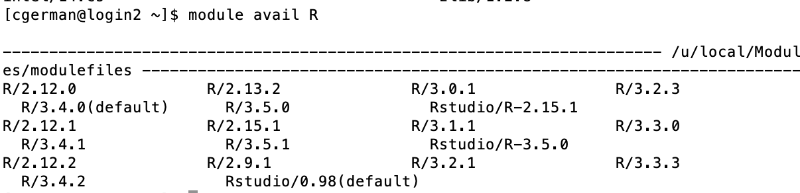
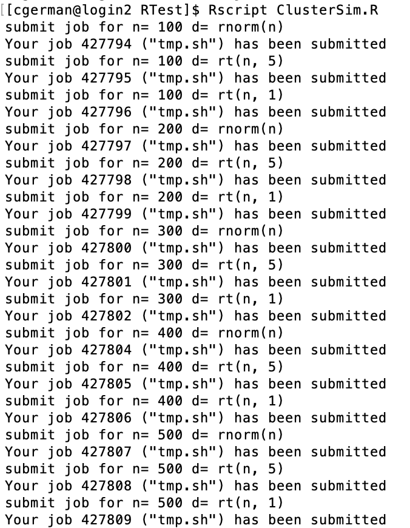

# Hoffman2 R Tutorial/ Cluster Computing

## What is it and how to use
For basic information on Hoffman2, including submitting jobs, resources available, transfering files, and other general information, refer to the general `README.md` file found at the [initial page of the github repo](https://github.com/chris-german/Hoffman2Tutorials).


  
# Available Software

There are several versions of R on the cluster, with more up-to-date ones being installed as they are released and requested. 

```bash
module avail R
```
{width=70%}


# Loading Software
To load a module, say R version 3.5.1, for use type:

```bash
module load R/3.5.1
```

If you are going to need packages installed for your use on Hoffman2, load R using `R` and then install the packges. Note: This will be on the login node, where computing power is limited so you should not run any analyses on this node. Instead, you run analyses on a compute node. 

# Accessing a compute node

## qsub

For most analyses/jobs you'd like to run on Hoffman2, you should use the `qsub` command. This submits a batch job to the queue (scheduler). The type of file you `qsub` has to have a specific format (batch script).


```bash
cat submit.sh
```

```
## #!/bin/bash #sets bash up
## #$ -cwd #uses current working directory
## # error = Merged with joblog
## #$ -o joblog.$JOB_ID #creates a file called joblog.jobidnumber to write to. 
## #$ -j y 
## #$ -l h_rt=0:30:00,h_data=2G #requests 30 minutes, 2GB of data (per core)
## #$ -pe shared 2 #requests 2 cores
## # Email address to notify
## #$ -M $USER@mail #don't change this line, finds your email in the system 
## # Notify when
## #$ -m bea #sends you an email (b) when the job begins (e) when job ends (a) when job is aborted (error)
## 
## # load the job environment:
## . /u/local/Modules/default/init/modules.sh
## module load R/3.5.1 #loads R/3.5.1 for use 
## 
## # run R code
## echo 'Running runSim.R for n = 500' #prints this quote to joblog.jobidnumber
## R -e "n = 500;  source('runSim.R')" > output.$JOB_ID 2>&1 #runs R code in quotes and outputs any text to output.jobid
```

To send this script to the scheduler to run on a compute node, you would simply type:


```bash
qsub submit.sh
```

## qrsh

For some analyses, you may want to do things interactively instead of just submitting jobs. The `qrsh` command is for loading you onto an interactive compute node. 

Typing `qrsh` on the Hoffman2 login node will submit q request for an interactive session. By default, the session will run for two hours and the physical memory alotted will be 1GB.

To request more, you can use the commmand

```bash
qrsh -l h_rt=4:00:00,h_data=4G
```

This will request a four hour session where the maximum physical memory is 4GB. 

If you'd like to use more than one CPU core for your job, add `-pe shared #` to the end. Note, the amount of memory requested will be for each core. For example, if you'd like to request 4 CPU cores, each with 2GB of memory for a total of 8GB for 5 hours, run:

```bash
qrsh -l h_rt=5:00:00,h_data=2G -pe shared 4
```

The more time and memory you request, the longer you will have to wait for an interactive compute node to become available to you. It's normal to wait a few minutes to get an interactive session. 

## R.q
In addition to submitting a shell script via`qsub`, for R, there is the command `R.q` that can be used to generate a shell `.sh` script for an `Rscript` file and submit the job. Simply upload a `.R` file that you want to run on the cluster and type `R.q`. Follow the prompts and it will run the `.R` file with the apporpriate options you select.

# Resource limitations
The maximum time for a session is 24 hours unless you're working in a group that owns their compute nodes. So do not have an `h_rt` value greated than `h_rt=24:00:00`.

Different compute nodes have different amounts of memory. There are fewer nodes with lots of memory, so the larger the amount of memory you're requesting the longer you will have to wait for the job to start running. If you request too much, the job may never run. 

Requesting more than 4 cores for an interactive session can possibly take a long time for the interactive session to start. 

## Using RStudio on Hoffman2

To use RStudio on Hoffman2, you must launch an interactive session via `qrsh` and then load the R studio module. Then you type `rstudio` and the RStudio IDE will launch. You may have to setup x11 forwarding, via this link [https://www.hoffman2.idre.ucla.edu/access/x11_forwarding](https://www.hoffman2.idre.ucla.edu/access/x11_forwarding). On a Mac, you will need to install XQuartz, run 

```bash
defaults write org.macosforge.xquartz.X11 enable_iglx -bool true
```
and when logging into Hoffman2, type:

```bash
ssh -Y username@hoffman2.idre.ucla.edu
```

If you get the warning message:
`Warning: No xauth data; using fake authentication data for X11 forwarding.`

You will need to setup a config file in your local machine's /.ssh/ path that specifies ForwardX11 yes.
On a Mac, you may also need to specify the XAuth location, for my computer I created the config file and added the following lines.  

Host hoffman2  
Hostname=hoffman2.idre.ucla.edu  
User=username  
XAuthLocation /opt/X11/bin/xauth  
ForwardAgent yes  
ForwardX11 yes  
ForwardX11Trusted yes  

This can be done on a mac via


```bash
nano ~/.ssh/config
```
Then typing the lines above, and pressing `control + O` to save then `enter` to save the name and then `control + X` to exit.

This sets up forwarding and also allows you to access the cluster as `username` by simply typing 


```bash
ssh hoffman2
```

Then to access RStudio run the following:

```bash
qrsh
module load R/3.5.1
module load Rstudio
rstudio
```

RStudio will launch in the application that you use for x11 forwarding and you can use it as you would RStudio on your own computer.


# Simulation runs

## A single simulation run

The `runSim.R` runs a simulation study to compare two methods for estimating mean: `est_mean_prime` and `est_mean_avg`. In each replicate, it generates a random vector of sample size `n`, from distribution `d`, and using seed `s`. There are `reps` replicates. Values of `n`, `d`, `s` and `reps` are to be defined by the user. `oFile` is the file to save the results under. Simulation results are written to a CSV file, `oFile`. 

```bash
cat runSim.R
```

```
## ## check if a given integer is prime
## isPrime = function(n) {
##   if (n <= 3) {
##     return (TRUE)
##   }
##   if (any((n %% 2:floor(sqrt(n))) == 0)) {
##     return (FALSE)
##   }
##   return (TRUE)
## }
## 
## ## estimate mean only using observation with prime indices
## estMeanPrimes = function (x) {
##   n = length(x)
##   ind = sapply(1:n, isPrime)
##   return (mean(x[ind]))
## }
## 
## # Simulate `reps` replicates of sample size `n` from distribution `d` using seed `s`
## simres = data.frame(est_mean_avg = double(reps), est_mean_prime = double(reps))
## for (r in 1:reps){
##   set.seed(s)
##   x = eval(parse(text = d))
##   simres[r, 1] = mean(x)
##   simres[r, 2] = estMeanPrimes(x)
## }
## 
## write.csv(simres, file = oFile, row.names = F)
```

To run this simulation from command line, user needs to pass values for `n`, `d`, `s`, `reps`, and `oFile`. For example,

```bash
module load R/3.5.1
R -e "n = 100; d = 'rnorm(n)'; reps = 100; s = 123; oFile = 'n_100d_rnorm(n).txt'; source('runSim.R')"
```

We can see the results have been written to the txt file.

```bash
head n_100d_rnorm\(n\).txt 
```

```
## "est_mean_avg","est_mean_prime"
## 0.0904059086362066,0.143506012799538
## 0.0904059086362066,0.143506012799538
## 0.0904059086362066,0.143506012799538
## 0.0904059086362066,0.143506012799538
## 0.0904059086362066,0.143506012799538
## 0.0904059086362066,0.143506012799538
## 0.0904059086362066,0.143506012799538
## 0.0904059086362066,0.143506012799538
## 0.0904059086362066,0.143506012799538
```

If you experience an error, you can take a look at the output.#### file that was generated. This files indicates any output generated in R. 

## Multiple simulation runs

In many projects, we vary the values of different simulation factors such as sample size, generative model, and so on. We can write another R script to organize multiple simulations. It's easy to set up and perform embarrasingly parallel simulation tasks.

On a cluster, each simulation needs to be submitted separately (spread across different compute nodes). The syntax depends on the scheduling system. On UCLA's Hoffman2 cluster, `qsub` is used. In `ClusterSim.R`, we loop over n = 100, 200, ..., 500 and generative models standard normal, T distribution with 5 degree of freedom, and T distribution with 1 degree of freedom and submit the jobs by building the file with each scenario to submit and using `qsub`. 

```bash
cat ClusterSim.R
```

```
## #File runs 100 replicates of finding the mean average and estimated mean prime
## #using seed 123 and sample sizes 100, 200, 300, 400, and 500 for distributioned
## #Normal(0, 1), t(5), t(1) on the Hoffman2 cluster. 
## 
## reps = 100 # number of simulation replicates
## s = 123 # seed
## nVals <- seq(100, 500, by=100)
## dists <- c("rnorm(n)", "rt(n, 5)", "rt(n, 1)")
## for (n in nVals){
##   for (d in dists){
##     #display job info
##     cat("submit job for n=", n, "d=", d, "\n")
##     #create outfile name
##     oFile <- paste("n_", n, "d_", d, ".txt", sep="")
##     #create rcode to run
##     rcode = paste0("n = ", n, "; d = '", d, "'; reps = ", reps, "; s = ", s,
##                    "; oFile = '", oFile, "'; source('runSim.R')")
##     
##     # prepare sh file for qsub
##     tp <- file("tmp.sh", "w")
##     writeLines(con = tp, "#!/bin/bash")
##     writeLines(con = tp, "#$ -cwd")
##     writeLines(con = tp, "# error = Merged with joblog")
##     writeLines(con = tp, "#$ -o joblog.$JOB_ID")
##     writeLines(con = tp, "#$ -j y")
##     writeLines(con = tp, "#$ -l h_rt=0:30:00,h_data=2G") # request runtime and memory
##     writeLines(con = tp, "#$ -pe shared 2") # request # shared-memory nodes
##     writeLines(con = tp, "# Email address to notify")
##     writeLines(con = tp, "#$ -M $USER@mail")
##     writeLines(con = tp, "# Notify when")
##     writeLines(con = tp, "#$ -m a")
##     writeLines(con = tp, "")
##     writeLines(con = tp, "# load the job environment:")
##     writeLines(con = tp, ". /u/local/Modules/default/init/modules.sh")
##     writeLines(con = tp, "module load R/3.5.1")
##     writeLines(con = tp, "")
##     writeLines(con = tp, "# run julia code")
##     cat(file = tp, "R -e \"", rcode, "\" > output.$JOB_ID 2>&1", sep = "")
##     close(tp)
##     sysCall <- paste("qsub tmp.sh")
##     system(sysCall)
##   }
## }
```

So on the cluster we just need to run

```bash
Rscript ClusterSim.R
```
{width=35%}


The generated `tmp.sh` file will read like this with different sample size and distributions created:

```bash
cat tmp.sh
```

```
## #!/bin/bash
## #$ -cwd
## # error = Merged with joblog
## #$ -o joblog.$JOB_ID
## #$ -j y
## #$ -l h_rt=0:30:00,h_data=2G
## #$ -pe shared 2
## # Email address to notify
## #$ -M $USER@mail
## # Notify when
## #$ -m a
## 
## # load the job environment:
## . /u/local/Modules/default/init/modules.sh
## module load R/3.5.1
## 
## # run julia code
## R -e "n = 500; d = 'rt(n, 1)'; reps = 100; s = 123; oFile = 'n_500d_rt(n, 1).txt'; source('runSim.R')" > output.$JOB_ID 2>&1
```

You can check on the state of your current jobs by running:

```bash
myjob
```
{width=550px}

To check the output files generated after the jobs have run.

```bash
ls *.txt
```

```
## n_100d_rnorm(n).txt
## n_100d_rt(n, 1).txt
## n_100d_rt(n, 5).txt
## n_200d_rnorm(n).txt
## n_200d_rt(n, 1).txt
## n_200d_rt(n, 5).txt
## n_300d_rnorm(n).txt
## n_300d_rt(n, 1).txt
## n_300d_rt(n, 5).txt
## n_400d_rnorm(n).txt
## n_400d_rt(n, 1).txt
## n_400d_rt(n, 5).txt
## n_500d_rnorm(n).txt
## n_500d_rt(n, 1).txt
## n_500d_rt(n, 5).txt
```


